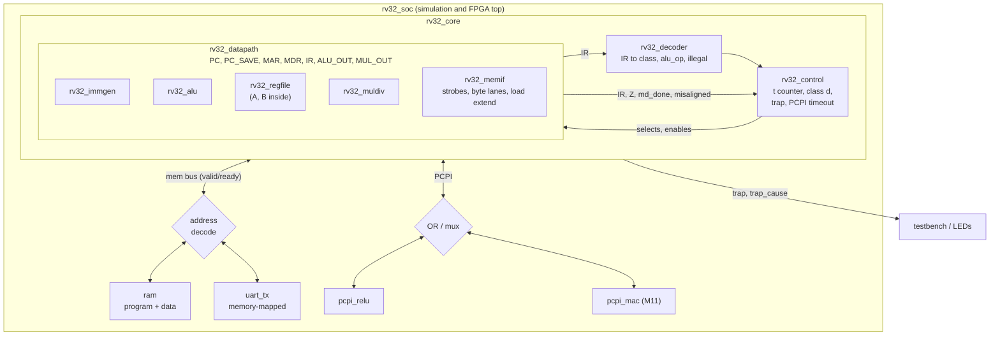

# PLAN: from the RV32IM + PCPI specification to a verified processor

Status: plan only. No RTL has been written.
Inputs read: `RV32IM_PCPI_RTL.pdf` (v1.0, 9 pages) and `README.md`.

Working agreement: all edits are local and uncommitted. You review, commit and push under your own name. No commit will carry a co-author line.

## Contents

0. Decisions I need from you, and two things I found
1. Spec review and the proposed spec v1.1
2. Architecture
3. Toolchain
4. Verification strategy
5. Repository structure and Makefile
6. Milestones
7. Compiler integration
8. FPGA path
9. Portfolio
10. CI
11. Risks and common beginner mistakes

---

## 0. Decisions I need from you, and two things I found

### Found while reading

1. **The PDF is not in git.** Commit `1f0ccaf` contains only `README.md` and `docs/social-preview.png`. `RV32IM_PCPI_RTL.pdf` is untracked, and the branch is level with `origin/main`, so the "Read the full specification" link in the README on GitHub points at a file that is not there. Fix: `git add RV32IM_PCPI_RTL.pdf`, commit, push.
2. **The spec claims "Full RV32I base instruction set" but sends FENCE, ECALL and EBREAK to `ILLEGAL_INSTR`.** The README roadmap admits this; the PDF's Scope section does not. Section 1 fixes it.

### Decisions (my recommendation is first in each)

| # | Decision | Recommendation | Alternative |
|---|---|---|---|
| Q1 | Where the implementation lives | Same repo, renamed to `rv32im-pcpi` (GitHub redirects the old URL). The spec and the core that proves it stay together. | A second repo `rv32im-pcpi-core` that links to the spec repo. |
| Q2 | How traps work | PicoRV32 style: the core raises a `trap` output with a cause code and halts until reset. No CSRs. | Minimal M-mode CSRs (`mtvec`, `mepc`, `mcause`, `mret`). Roughly 2 extra weeks. Parked as an optional later milestone. |
| Q3 | Cycle timing in the first implementation | Keep v1.0's separate `COUNTER <- T0` state, so measured cycle counts can be checked against the table already published in the README. Fold it away later as a measured optimisation (milestone M12). | Fold it immediately in v1.1 and update the README table. |
| Q4 | Multiplier and divider | Iterative, 32 cycles, using the same start/done stall pattern as PCPI. | Single-cycle `*` on FPGAs with DSP blocks. Never a single-cycle `/`. |
| Q5 | MAC coprocessor shape | Register operands (`acc += rs1 * rs2`), fits PCPI unchanged. | Vector dot product with its own memory port, as the spec's last design note sketches. Parked as a stretch goal. |
| Q6 | FPGA board | Decide at M8 so it arrives by M10. iCEBreaker if budget and shipping allow, Tang Nano 9K otherwise. | Colorlight i5 for more headroom. |

---

## 1. Spec review and the proposed spec v1.1

Severity: **Blocker** = cannot pass tests without it. **Bug** = spec says something wrong. **Gap** = spec is silent. **Improve** = works but should change.

### 1.1 Findings

| ID | Sev. | Where | Problem | v1.1 change |
|---|---|---|---|---|
| S1 | Blocker | Register file | x0 is never mentioned. Every `RF[RD] <- ...` would overwrite x0. `nop`, `j`, `ret` and most of riscv-tests rely on x0 being zero. | "RF[0] reads as 0. Every `RF[RD] <- v` is conditional on `RD != 0`." |
| S2 | Bug | D4 T4 | `ALU_OUT <- A + IMM(I)`. For a store, `IR[24:20]` is rs2, so the I-immediate gives a wrong address. | `ALU_OUT <- A + IMM(S)` |
| S3 | Gap | Whole document | `IMM(I/S/B/U/J)` are used but never defined. The B and J bit orders are scrambled and are the classic place for bugs. | Add the immediate table in 1.2. |
| S4 | Blocker | 2.1 decoder | FENCE (0x0F), ECALL and EBREAK (0x73) are missing. riscv-tests end every test with ECALL. | Add classes D11 (MISC-MEM) and D12 (SYSTEM). See 1.3. |
| S5 | Gap | 2.1 decoder | `ILLEGAL_INSTR` is named but has no behaviour. | Define the TRAP state. See 1.3. |
| S6 | Gap | T1, D3 T6, D4 T6 | Memory timing is assumed, not stated. `MDR <- MEM[MAR]` in one state only works with a zero-latency (combinational-read) memory. FPGA block RAM is synchronous, and UART or flash can be slower still. | Define a valid/ready memory bus. Memory states hold until `MEM_READY`. See 1.4. |
| S7 | Gap | D3, D4 | `MEM_STRB` appears once and is undefined. Nothing says the bus is word-wide, little-endian, how SB/SH data is moved to the right byte lane, or how LB/LH select a byte from `MAR[1:0]`. Misaligned access is undefined. | See 1.4. |
| S8 | Improve | D4 T5 | `MDR <- RF[RS2]` re-reads the register file although B already holds that value. | `MDR <- B` |
| S9 | Bug | D1 T4 | Single-state `$A / $B` and a 64-bit product. A combinational 32-bit divider is thousands of gates deep and sets the clock period for the whole core. A LUT-only FPGA cannot do a fast 32x32 multiply either. | Multi-cycle unit with start/done. See 1.5. |
| S10 | Gap | D1 | Rounding (toward zero) and remainder sign (same as dividend) are not stated. | State both. |
| S11 | Bug | 2.1 | The table says `funct7 == 0x00/0x20 -> D0` and `funct7 == 0x01 -> D1`. The `case` code tests only `funct7[0]`, so `funct7 = 0x21` runs as an M instruction and `funct7 = 0x02` runs as ADD. | Full decode. Anything not listed is ILLEGAL. |
| S12 | Gap | D2, D3, D4, D5, D7 | Unused encodings are not rejected: SLLI/SRLI/SRAI with a bad funct7, LOAD funct3 3/6/7, STORE funct3 3..7, BRANCH funct3 2/3, JALR funct3 != 0 (the table says `== 0x00`, the code ignores it). | All go to ILLEGAL. |
| S13 | Gap | D5 T5 | `Z` is never defined, and the wording "Z true" is unclear. The logic itself is correct once `Z = (ALU_OUT == 0)`. The not-taken case is implicit. | Define `Z`. Write the not-taken case as "no transfer". |
| S14 | Gap | Whole document | No reset behaviour. | "On reset: `PC <- RESET_VECTOR` (parameter, default 0), `COUNTER <- T0`, `PCPI_VALID <- 0`, `TRAP <- 0`." |
| S15 | Bug | D10 | `PCPI_WAIT` is in the signal table but no transfer uses it. In PicoRV32 it is what tells the core "someone has claimed this, do not time out". | Use it in the timeout rule. See 1.6. |
| S16 | Bug | D10 T5/T6 | `PCPI_READY` is "pulsed", and `PCPI_R` is only valid during that pulse, but `RF[RD] <- PCPI_R` happens one state later. A multi-cycle coprocessor will have dropped the result by then. | Write the register file in the cycle `PCPI_READY` is high. |
| S17 | Gap | D10 | `PCPI_R` is listed as a core register and also assigned "inside coprocessor". Ownership is unclear. `PCPI_A`, `PCPI_B`, `PCPI_IR` duplicate A, B and IR, which are already stable during Execute. | `PCPI_R` is a coprocessor output. `PCPI_A/B/IR` are wires from A, B, IR. |
| S18 | Gap | D10 | The RELU encoding is undefined beyond the opcode. No funct3 or funct7, and no word on rs2. Without it nothing can decide "claimed" versus "unclaimed". | See 1.6. |
| S19 | Blocker for M8 | D10 | The timeout is described but not specified. | See 1.6. |
| S20 | Gap | D10 | No way for a coprocessor instruction to produce no result (for example "clear accumulator"). PicoRV32 has `pcpi_wr` for this. | Add `PCPI_WR`. |
| S21 | Gap | D5, D6, D7 | A jump target with bit 1 set is an instruction-address-misaligned exception when the C extension is absent. | Trap with cause 0 when a taken target has `[1] == 1`. |
| S22 | Improve | Every class | `COUNTER <- T0` is its own state. In Mano's book `SC <- 0` shares a line with the last transfer. This costs one cycle on every instruction. | Decision Q3. |
| S23 | Improve | Overview | "single-cycle-per-microoperation" next to the README's "multi-cycle processor" will confuse readers. | Call it a multi-cycle design where each timing state is one clock cycle. |
| S24 | Improve | Scope | "Full RV32I" overclaims. | After v1.1 it is true for the unprivileged ISA. Say so, and say there are no CSRs. |

Two things the spec gets right that often go wrong, worth a sentence in v1.1 so nobody "fixes" them:
- **JALR with rd == rs1** is safe, because A was latched at T3 before `RF[RD] <- PC` at T4.
- **ADDI has no subtract.** D2 funct3=0 ignores `funct7[5]`, which is correct because those bits are part of the immediate.

### 1.2 Immediates (new section)

| Name | Definition |
|---|---|
| IMM(I) | `sext(IR[31:20])` |
| IMM(S) | `sext({IR[31:25], IR[11:7]})` |
| IMM(B) | `sext({IR[31], IR[7], IR[30:25], IR[11:8], 1'b0})` |
| IMM(U) | `{IR[31:12], 12'b0}` |
| IMM(J) | `sext({IR[31], IR[19:12], IR[20], IR[30:21], 1'b0})` |

`sext` copies `IR[31]` into all upper bits. In every format the sign bit is `IR[31]`.

### 1.3 Traps, SYSTEM and MISC-MEM (new section)

A trap stops the core. This is what PicoRV32 does when interrupts are disabled, and it needs no CSRs.

```
TRAP:  TRAP <- 1, CAUSE <- c        (COUNTER holds; only reset leaves this state)
```

`PC_SAVE` still holds the address of the trapping instruction, so a testbench or debugger can read it.

Cause codes use the standard `mcause` numbers, so adding CSRs later does not renumber anything:

| Cause | Value | Raised by |
|---|---|---|
| Instruction address misaligned | 0 | S21 |
| Illegal instruction | 2 | decoder default, S11, S12, PCPI timeout |
| Breakpoint | 3 | EBREAK |
| Load address misaligned | 4 | LH with `MAR[0]`, LW with `MAR[1:0] != 0` |
| Store address misaligned | 6 | SH, SW likewise |
| Environment call | 11 | ECALL |

New decode classes:

```
7'b0001111: D11      // MISC-MEM: FENCE, FENCE.I
7'b1110011: D12      // SYSTEM

D11 - MISC-MEM
T4: COUNTER <- T0                     (no operation: one hart, no cache)

D12 - SYSTEM
T4: IR == 0x00000073 (ECALL):  TRAP, CAUSE <- 11
    IR == 0x00100073 (EBREAK): TRAP, CAUSE <- 3
    otherwise:                 TRAP, CAUSE <- 2
```

FENCE.I as a no-op is correct here because fetch always reads memory directly, so the riscv-tests `fence_i` test (self-modifying code) passes.

### 1.4 Memory interface (new section)

One 32-bit, word-addressed, little-endian bus, shared by fetch and data. The signals follow PicoRV32's native bus so its peripherals and documentation carry over.

| Signal | Direction | Meaning |
|---|---|---|
| `MEM_VALID` | core -> memory | A transfer is requested. Held until `MEM_READY`. |
| `MEM_ADDR[31:0]` | core -> memory | `{MAR[31:2], 2'b00}` |
| `MEM_WDATA[31:0]` | core -> memory | Write data, already moved to the right byte lane |
| `MEM_WSTRB[3:0]` | core -> memory | One bit per byte. `0000` means read. |
| `MEM_RDATA[31:0]` | memory -> core | Valid in the cycle `MEM_READY` is high |
| `MEM_READY` | memory -> core | Transfer completes this cycle |

Changed states:

```
T1:    MEM_VALID.  if MEM_READY: MDR <- MEM_RDATA, PC <- PC+4.  else hold
D3 T6: MEM_VALID.  if MEM_READY: MDR <- MEM_RDATA.              else hold
D3 T7: RF[RD] <- LOADEXT(MDR, MAR[1:0], funct3)
D4 T4: ALU_OUT <- A + IMM(S)
D4 T5: MAR <- ALU_OUT, MDR <- B
D4 T6: MEM_VALID, MEM_WSTRB <- STRB(funct3, MAR[1:0]),
       MEM_WDATA <- MDR << (8 * MAR[1:0]).  hold until MEM_READY
```

| Store | `MEM_WSTRB` | Load | `LOADEXT` |
|---|---|---|---|
| SB | `0001 << MAR[1:0]` | LB / LBU | byte `MAR[1:0]` of MDR, sign / zero extended |
| SH | `0011 << MAR[1:0]` | LH / LHU | half at `MAR[1]`, sign / zero extended |
| SW | `1111` | LW | MDR |

The cycle counts in the README are for a memory that answers in the same cycle. Each wait cycle adds one.

### 1.5 M-extension (replaces D1)

```
T4: MD_START <- 1                                  (operands A, B; op = funct3)
T5: if MD_DONE': hold.   if MD_DONE: MUL_OUT <- MD_RESULT
T6: RF[RD] <- MUL_OUT
T7: COUNTER <- T0
```

- MUL family: shift-and-add over 33-bit sign-adjusted operands, 32 iterations.
- DIV family: restoring division on magnitudes, 32 iterations, then sign correction. Quotient rounds toward zero. Remainder takes the dividend's sign.
- Restoring division by zero already produces quotient = all ones and remainder = dividend, which are the RISC-V results for DIVU/REMU. The signed case needs one rule: when the divisor is zero, do not negate the quotient. `INT_MIN / -1` comes out right without a special case (magnitude `0x80000000 / 1`, negated, is `0x80000000`). The unit tests in section 4 must confirm both, rather than this paragraph being trusted.

### 1.6 PCPI (replaces D10)

RELU encoding, R-type:

| funct7 | rs2 | rs1 | funct3 | rd | opcode |
|---|---|---|---|---|---|
| `0000000` | ignored (assemble as x0) | source | `000` | destination | `0001011` |

`RELU(x) = x[31] ? 0 : x`. In GNU assembler: `.insn r 0x0B, 0, 0, a0, a1, x0`.

Reserved for later on the same opcode: funct3 `001` MAC, `010` MACCLR, `011` MACRD.

```
T4: PCPI_VALID <- 1, TIMEOUT <- 0             (PCPI_A = A, PCPI_B = B, PCPI_IR = IR are wires)
T5: if PCPI_READY:
        if PCPI_WR: RF[RD] <- PCPI_R
        PCPI_VALID <- 0, go to T6
    else if PCPI_WAIT:   hold
    else if TIMEOUT = 15: PCPI_VALID <- 0, TRAP, CAUSE <- 2
    else:                TIMEOUT <- TIMEOUT + 1, hold
T6: COUNTER <- T0
```

Coprocessor contract:
- Decode `PCPI_IR` while `PCPI_VALID` is high. If the instruction is not yours, drive nothing.
- If you need more than a few cycles, raise `PCPI_WAIT` and keep it high until you raise `PCPI_READY`.
- `PCPI_READY` is high for exactly one cycle, with `PCPI_R` and `PCPI_WR` valid in that cycle.
- With several coprocessors, the core sees the OR of their `WAIT` and `READY` and a mux of their results.

### 1.7 How to publish v1.1

Decided on 2026-10-06: `RV32IM_PCPI_RTL.pdf` stays exactly as it is, at the repo root. It is the introductory spec already shared publicly, and it is not edited, moved or regenerated.

- v1.1 is a separate document, `docs/spec/implementation-spec.md`, written in Markdown so a change shows up as a readable diff. It is what the RTL is built and checked against.
- `docs/spec/errata.md` lists S1 to S24 as differences from the PDF, so a reader of the PDF can see what an implementation needs on top of it.
- The README links to both and says which is which.

---

## 2. Architecture

### 2.1 Design rules

1. **Keep the Mano encoding in the RTL.** The control unit holds a 4-bit `t` counter and a decoded class `d`. Control signals are written as `(d == D_LOAD) && (t == T6)`, the SystemVerilog form of Mano's `D3T6`. A reader can put the spec and the code side by side.
2. **Control and datapath are separate modules.** Control produces only select and enable signals. The datapath holds every register in the spec's table and no decisions.
3. **One ALU.** It is free at T1, so it also computes `PC + 4`, and at T5 it computes branch and jump targets. Operand muxes choose between A, PC, PC_SAVE and B, IMM, 4.
4. **Synchronous-read register file.** The spec reads the register file at T3 and uses A and B from T4. If the read is registered inside the register file, its output registers are A and B. That maps onto FPGA block RAM with no change later. An asynchronous-read register file would turn into about 1000 flip-flops.
5. **Stalls are "counter holds".** Memory wait, mul/div busy and PCPI wait all use one mechanism: `t` does not advance.
6. **One clock, synchronous active-low reset (`rst_n`), no latches, no tristates.**

### 2.2 Module diagram



### 2.3 Timing states to control signals (v1.1, zero-wait memory)

`+` means "also asserted in the same state". States marked (hold) repeat until their condition is true.

| State | Register transfer | Control signals asserted |
|---|---|---|
| T0 | `MAR <- PC, PC_SAVE <- PC` | `mar_we`, `mar_sel=PC`, `pcsave_we` |
| T1 (hold) | `MDR <- MEM, PC <- PC+4` | `mem_valid`; on ready: `mdr_we`, `mdr_sel=MEM`, `alu_a=PC`, `alu_b=4`, `alu_op=ADD`, `pc_we` |
| T2 | `IR <- MDR` | `ir_we` |
| T3 | `A, B <- RF` | `rf_re`; class `d` is latched from the decoder |
| D0 T4 | `ALU_OUT <- A op B` | `alu_a=A`, `alu_b=B`, `alu_op` from decoder, `aluout_we` |
| D2 T4 | `ALU_OUT <- A op IMM` | as D0 with `alu_b=IMM` |
| D0/D2/D9 T5 | `RF[RD] <- ALU_OUT` | `rf_we`, `rf_wsel=ALU_OUT` |
| D1 T4 | start | `md_start` |
| D1 T5 (hold) | `MUL_OUT <- result` | on `md_done`: `mulout_we` |
| D1 T6 | `RF[RD] <- MUL_OUT` | `rf_we`, `rf_wsel=MUL_OUT` |
| D3/D4 T4 | `ALU_OUT <- A + IMM` | `alu_a=A`, `alu_b=IMM`, `alu_op=ADD`, `aluout_we` |
| D3 T5 | `MAR <- ALU_OUT` | `mar_we`, `mar_sel=ALU_OUT` |
| D3 T6 (hold) | `MDR <- MEM` | `mem_valid`; on ready `mdr_we` |
| D3 T7 | `RF[RD] <- LOADEXT` | `rf_we`, `rf_wsel=LOAD` |
| D4 T5 | `MAR <- ALU_OUT, MDR <- B` | `mar_we`, `mdr_we`, `mdr_sel=B` |
| D4 T6 (hold) | `MEM <- MDR` | `mem_valid`, `mem_write` |
| D5 T4 | compare into `ALU_OUT` | `alu_op` = SUB, SLT or SLTU, `aluout_we` |
| D5 T5 | `PC <- PC_SAVE + IMM(B)` if taken | `alu_a=PC_SAVE`, `alu_b=IMM`, `pc_we = taken` |
| D6 T4 | `RF[RD] <- PC` | `rf_we`, `rf_wsel=PC` |
| D6 T5 | `PC <- PC_SAVE + IMM(J)` | `alu_a=PC_SAVE`, `alu_b=IMM`, `pc_we` |
| D7 T4 | `RF[RD] <- PC, ALU_OUT <- A + IMM` | `rf_we`, `rf_wsel=PC`, `aluout_we` |
| D7 T5 | `PC <- ALU_OUT & ~1` | `pc_we`, `pc_sel=ALU_OUT` |
| D8 T4 | `RF[RD] <- IMM(U)` | `rf_we`, `rf_wsel=IMM` |
| D9 T4 | `ALU_OUT <- PC_SAVE + IMM(U)` | `alu_a=PC_SAVE`, `alu_b=IMM`, `aluout_we` |
| D10 T4 | `PCPI_VALID <- 1` | `pcpi_valid_set` |
| D10 T5 (hold) | `RF[RD] <- PCPI_R` | on ready: `rf_we = pcpi_wr`, `rf_wsel=PCPI`, `pcpi_valid_clr` |
| D11 T4 | none | `t_clr` |
| D12 T4 | trap | `trap_set`, `cause` |
| last state of each class | `COUNTER <- T0` | `t_clr` |

### 2.4 Module interfaces

Shared types live in `rv32_pkg.sv`: `class_e` (D0..D12, D_ILLEGAL), `alu_op_e` (ADD, SUB, SLL, SLT, SLTU, XOR, SRL, SRA, OR, AND), the mux-select enums, and the cause codes.

```systemverilog
module rv32_core #(parameter logic [31:0] RESET_VECTOR = 32'h0) (
  input  logic        clk, rst_n,
  // memory bus
  output logic        mem_valid,
  output logic [31:0] mem_addr, mem_wdata,
  output logic [3:0]  mem_wstrb,
  input  logic [31:0] mem_rdata,
  input  logic        mem_ready,
  // PCPI
  output logic        pcpi_valid,
  output logic [31:0] pcpi_insn, pcpi_rs1, pcpi_rs2,
  input  logic        pcpi_wr, pcpi_wait, pcpi_ready,
  input  logic [31:0] pcpi_rd,
  // status
  output logic        trap,
  output logic [3:0]  trap_cause
);

module rv32_decoder (            // combinational
  input  logic [31:0] ir,
  output class_e      cls,       // D0..D12 or D_ILLEGAL
  output alu_op_e     alu_op,    // for D0, D2, D5
  output logic        is_ecall, is_ebreak
);

module rv32_control (
  input  logic        clk, rst_n,
  input  class_e      cls,
  input  logic [2:0]  funct3,
  input  logic        z,                    // ALU_OUT == 0
  input  logic        mem_ready, md_done,
  input  logic        pcpi_wait, pcpi_ready, pcpi_wr,
  input  logic        misaligned,           // from memif / jump target
  input  logic        is_ecall, is_ebreak,
  output logic        pc_we, pcsave_we, mar_we, mdr_we, ir_we,
  output logic        rf_re, rf_we, aluout_we, mulout_we,
  output pc_sel_e     pc_sel,
  output mar_sel_e    mar_sel,
  output mdr_sel_e    mdr_sel,
  output alu_a_sel_e  alu_a_sel,
  output alu_b_sel_e  alu_b_sel,
  output logic        alu_force,            // 1: use alu_force_op instead of decoder's
  output alu_op_e     alu_force_op,
  output rf_wsel_e    rf_wsel,
  output logic        mem_valid, mem_write,
  output logic        md_start,
  output logic        pcpi_valid,
  output logic        trap,
  output logic [3:0]  trap_cause
);

module rv32_datapath #(parameter logic [31:0] RESET_VECTOR = 32'h0) (
  input  logic        clk, rst_n,
  // every select and enable from rv32_control (omitted here; same names)
  output logic [31:0] ir,
  output logic        z, md_done, misaligned,
  output logic [31:0] mem_addr, mem_wdata,
  output logic [3:0]  mem_wstrb,
  input  logic [31:0] mem_rdata,
  output logic [31:0] pcpi_rs1, pcpi_rs2,
  input  logic [31:0] pcpi_rd
);

module rv32_alu (                // combinational
  input  logic [31:0] a, b,
  input  alu_op_e     op,
  output logic [31:0] y
);

module rv32_regfile (
  input  logic        clk,
  input  logic        re,                   // T3: latch A and B
  input  logic [4:0]  rs1, rs2,
  output logic [31:0] a, b,                 // registered: these are the spec's A and B
  input  logic        we,
  input  logic [4:0]  rd,
  input  logic [31:0] wdata                 // ignored when rd == 0
);

module rv32_immgen (             // combinational
  input  logic [31:0] ir,
  output logic [31:0] imm                   // format chosen from ir[6:0]
);

module rv32_muldiv (
  input  logic        clk, rst_n,
  input  logic        start,                // one-cycle pulse
  input  logic [2:0]  op,                   // funct3
  input  logic [31:0] a, b,
  output logic        done,                 // one-cycle pulse, result valid
  output logic [31:0] result
);

module rv32_memif (              // combinational
  input  logic [2:0]  funct3,
  input  logic [1:0]  addr_lo,              // MAR[1:0]
  input  logic [31:0] store_data,           // MDR
  output logic [31:0] mem_wdata,
  output logic [3:0]  mem_wstrb,            // for a store; control gates it with mem_write
  input  logic [31:0] load_raw,             // MDR
  output logic [31:0] load_data,
  output logic        misaligned
);

module pcpi_relu (               // combinational; later coprocessors add clk, rst_n
  input  logic        pcpi_valid,
  input  logic [31:0] pcpi_insn, pcpi_rs1, pcpi_rs2,
  output logic        pcpi_wr, pcpi_wait, pcpi_ready,
  output logic [31:0] pcpi_rd
);

module rv32_soc #(parameter string FIRMWARE = "firmware.hex",
                  parameter int    RAM_WORDS = 16384) (
  input  logic clk, rst_n,
  output logic uart_tx,
  output logic trap,
  output logic [3:0] trap_cause
);
```

Memory map of `rv32_soc`:

| Address | Device |
|---|---|
| `0x0000_0000` to `RAM_WORDS*4 - 1` | RAM, loaded from `FIRMWARE` |
| `0x1000_0000` | UART TX data (write a byte) |
| `0x1000_0004` | UART status (bit 0 = busy) |
| `0x1000_0008` | LEDs (FPGA) |

---

## 3. Toolchain

Your machine (Ubuntu 24.04) already has Icarus Verilog 12.0, Verilator 5.020 and GTKWave. Yosys and a RISC-V compiler are missing.

| Tool | Why you need it | Install |
|---|---|---|
| Icarus Verilog (`iverilog`, `vvp`) | The main simulator. Event-driven and 4-state, so an uninitialised register shows up as `x` in the waveform, not as a silent 0. Compiles in a second. Use `-g2012` for SystemVerilog. | installed (`sudo apt install iverilog`) |
| Verilator | Used first as a linter: `verilator --lint-only -Wall` catches width mismatches, inferred latches and unused signals that Icarus accepts silently. Later, as a fast 2-state simulator for the long neural-network run. | installed (`sudo apt install verilator`) |
| GTKWave | Reads the `.vcd`/`.fst` dump and shows signals over time. This is your debugger. | installed (`sudo apt install gtkwave`) |
| RISC-V GCC and binutils | Assembles and links test programs, and is the reference compiler to compare yours against. `objdump -d` is how you check what an instruction word means. | `sudo apt install gcc-riscv64-unknown-elf binutils-riscv64-unknown-elf` |
| riscv-tests | The official per-instruction self-checking tests. Passing them is the accepted meaning of "this core implements RV32IM". | `git submodule add https://github.com/riscv-software-src/riscv-tests tests/riscv-tests` then `git submodule update --init --recursive` |
| Python 3, make, git | Glue: hex conversion, test runner, build. | installed |
| cocotb (from M6) | Python testbenches. See 4.6. | `python3 -m venv .venv && . .venv/bin/activate && pip install cocotb` |
| OSS CAD Suite (from M10) | One download with current Yosys, nextpnr for iCE40, ECP5 and Gowin, the bitstream tools and openFPGALoader. Ubuntu's Yosys 0.33 and nextpnr 0.6 are too old for the Gowin flow. | Download the `linux-x64` archive from `github.com/YosysHQ/oss-cad-suite-build/releases`, extract, `source oss-cad-suite/environment` |

Notes:
- The Ubuntu compiler is named `riscv64-unknown-elf-gcc` but builds 32-bit code with `-march=rv32i -mabi=ilp32` (or `rv32im`). Check with `riscv64-unknown-elf-gcc -print-multi-lib` that an `rv32i/ilp32` line exists. If it does not, use the xPack `riscv-none-elf-gcc` prebuilt release.
- Always pass `-nostdlib -ffreestanding`. There is no operating system and no C library on this core.
- Pin the riscv-tests submodule to a commit. The test list changes upstream.
- Optional later: Spike (the reference instruction-set simulator), to compare an instruction trace against the core. Not needed to reach any milestone.

---

## 4. Verification strategy

Principle: every test is self-checking and prints one final line, `PASS` or `FAIL <reason>`. The runner treats a missing `PASS` as a failure, which also catches crashes and hangs. Every testbench has a cycle limit.

### 4.1 Unit testbenches (one per module)

| Module | Directed cases | Random cases |
|---|---|---|
| `rv32_alu` | Each op at 0, 1, -1, INT_MIN, INT_MAX. Shift by 0 and 31. SLT against SLTU on mixed signs. | 10,000 vectors against one-line reference expressions in the testbench |
| `rv32_regfile` | Write then read all 32. Write x0 and read back 0. `rs1 == rs2`. `we = 0` writes nothing. | Random writes against a shadow array |
| `rv32_immgen` | One known instruction per format with positive and negative immediates. Vectors come from `objdump`, not from your own reading of the spec. | none |
| `rv32_decoder` | Every legal opcode/funct3/funct7. Every illegal case in S11 and S12. | All 2^17 combinations of opcode, funct3, funct7 against a table |
| `rv32_memif` | SB/SH/SW at every offset. All five loads at every offset. Misaligned flags. | none |
| `rv32_muldiv` | The table in 4.4. | 100,000 vectors against `*`, `/`, `%` in the testbench |
| `pcpi_relu` | 0, 1, -1, INT_MIN, INT_MAX. Wrong funct3 is not claimed. | none |

Using `/` and `*` in a testbench as the reference is fine. The rule against them applies to synthesised RTL.

### 4.2 Instruction-level tests

Short hand-written assembly programs, one per decode class, in `tests/asm/`. Each ends with the same convention as riscv-tests (4.3). They exist because riscv-tests cannot be used for bring-up: every riscv-test needs `li`, `bne`, shifts and ECALL to work before it can report anything.

Order: LUI, ADDI, then the rest of D2 and D0, then AUIPC, JAL, JALR, branches, loads, stores.

Each program also checks the things unit tests cannot see: `rd = x0`, `rd = rs1`, branch backwards, branch not taken, JALR clearing bit 0, store then load at each byte offset.

### 4.3 riscv-tests and how ECALL signals pass or fail

The stock `p` environment cannot be used. Its start-up code executes `csrw mtvec`, `csrr mhartid` and `mret`, and this core has no CSRs. The standard answer for a CSR-less core, and what PicoRV32 does, is to reuse the test sources with your own environment header. `tests/env/riscv_test.h` (about 20 lines, to be checked against the pinned commit) defines:

```c
#define RVTEST_RV32U
#define RVTEST_RV64U
#define TESTNUM gp
#define RVTEST_CODE_BEGIN  .section .text.init; .globl _start; _start:
#define RVTEST_CODE_END
#define RVTEST_PASS  li a0, 0;  li a7, 93; ecall
#define RVTEST_FAIL  sll a0, TESTNUM, 1; ori a0, a0, 1; li a7, 93; ecall
#define RVTEST_DATA_BEGIN  .data; .align 4;
#define RVTEST_DATA_END
```

The test sources and `isa/macros/scalar/test_macros.h` are used unmodified from the submodule.

The contract at ECALL:

| Register | Pass | Fail |
|---|---|---|
| `a0` (x10) | 0 | `(test number << 1) \| 1` |
| `gp` (x3) | last test number | failing test number |

The testbench watches the `trap` output:

```
trap && cause == 11 && x10 == 0   -> print "PASS"
trap && cause == 11 && x10 != 0   -> print "FAIL test <x10 >> 1>"
trap && cause != 11               -> print "FAIL trap cause <n> at pc <PC_SAVE>"
cycle limit reached               -> print "FAIL timeout at pc <PC_SAVE>"
```

Scope:
- `rv32ui`: every test except `ma_data`, which needs misaligned loads and stores to succeed. This core traps on them. The exclusion goes in the README with the reason.
- `rv32um`: all eight.
- The pass count is printed by the runner. Do not hard-code it.

Then run the whole suite a second time with a memory model that inserts random wait cycles. This is the cheapest way to find handshake bugs before the FPGA does.

### 4.4 M-extension edge cases

| Operation | Operands | Expected |
|---|---|---|
| DIV | x / 0 | `0xFFFFFFFF` |
| DIVU | x / 0 | `0xFFFFFFFF` |
| REM, REMU | x % 0 | x |
| DIV | `0x80000000` / -1 | `0x80000000` |
| REM | `0x80000000` % -1 | 0 |
| DIV, REM | -7, 2 | -3, -1 |
| DIV, REM | 7, -2 | -3, 1 |
| DIV, REM | -7, -2 | 3, -1 |
| MULH | `0x80000000` * `0x80000000` | `0x40000000` |
| MULHSU | -1 * `0xFFFFFFFF` | `0xFFFFFFFF` |
| MULHU | `0xFFFFFFFF` * `0xFFFFFFFF` | `0xFFFFFFFE` |
| MUL | `0xFFFFFFFF` * `0xFFFFFFFF` | 1 |
| any | rd = rs1 = rs2 | correct, operands were latched |
| any | rd = x0 | x0 stays 0, core does not hang |
| any | two in a row | the second start is not lost |

### 4.5 PCPI stall and timeout

A testbench coprocessor with a programmable delay replaces `pcpi_relu`.

| Case | Check |
|---|---|
| Latency 0, 1, 2, 5, 40 with `WAIT` held | Correct result. Total cycles = 7 + latency (v1.1 timing: T0 to T4 is 5 cycles, T5 lasts latency + 1 cycles, T6 is 1). |
| `READY` high for exactly one cycle | Result still written (this is S16) |
| No `mem_valid` during the stall | The core does not fetch while waiting |
| `pcpi_valid` low after completion | No second dispatch |
| `PCPI_WR = 0` | rd unchanged |
| rd = x0 | x0 stays 0 |
| No responder | Trap, cause 2, exactly 16 cycles after dispatch, `pcpi_valid` low |
| `WAIT` held for 100 cycles, then `READY` | No timeout |
| `WAIT` for 5 cycles, then dropped without `READY` | Timeout counts from where it stopped |
| RELU with funct3 = 7 | Not claimed, so timeout trap |

### 4.6 Should you use cocotb?

Yes, but not at the start.

- **M2 to M5: plain SystemVerilog testbenches.** You are learning the language, and a testbench is the fastest place to learn it. With cocotb, a failure could be in your RTL, your Python, or the layer between them, and you could not yet tell which.
- **From M6: cocotb for three jobs where Python is clearly better.** Random mul/div checked against Python integers, which never overflow. The PCPI coprocessor model with random delays. The neural-network result checked against the same NumPy code that produced the weights.
- Run cocotb on Icarus. cocotb 2.x needs a much newer Verilator than Ubuntu's 5.020.

It is also worth having on a CV, because Python-based verification is common in industry. That is a reason to learn it, not a reason to start with it.

### 4.7 Measurements built into the testbench

Counters for cycles and retired instructions, per decode class. They give the cycles-per-instruction figures in section 9 and one extra check: with a zero-wait memory, each class must take exactly the cycle count in the spec.

---

## 5. Repository structure and Makefile

```
rv32im-pcpi/
├── README.md
├── PLAN.md
├── Makefile
├── LICENSE
├── .github/workflows/ci.yml
├── docs/
│   ├── spec/                 implementation-spec.md (v1.1), errata.md (the PDF stays at the root)
│   ├── img/                  waveform screenshots, diagrams, social preview
│   └── journal/              one short note per milestone: what broke, what you learned
├── rtl/
│   ├── rv32_pkg.sv
│   ├── rv32_core.sv  rv32_control.sv  rv32_datapath.sv  rv32_decoder.sv
│   ├── rv32_alu.sv  rv32_regfile.sv  rv32_immgen.sv  rv32_muldiv.sv  rv32_memif.sv
│   ├── pcpi/                 pcpi_relu.sv, pcpi_mac.sv
│   └── soc/                  rv32_soc.sv, ram.sv, uart_tx.sv
├── tb/
│   ├── unit/                 tb_alu.sv, tb_regfile.sv, ...
│   ├── core/                 tb_core.sv (loads a hex, watches trap), wait-state RAM, PCPI delay model
│   ├── cocotb/               from M6
│   └── waves/                *.gtkw saved GTKWave layouts
├── sw/
│   ├── common/               crt0.S, link.ld, uart.h
│   ├── hello/
│   ├── bench/                small programs for CPI measurement
│   └── nn/                   M11: train.py, weights.h, infer.c
├── tests/
│   ├── asm/                  instruction-level tests (4.2)
│   ├── env/                  riscv_test.h (4.3)
│   ├── compiler/             M9: your compiler's programs + expected output
│   └── riscv-tests/          git submodule
├── scripts/
│   ├── bin2hex.py            binary -> one 32-bit little-endian word per line
│   └── run_tests.py          runs a list of hex files, prints a table, exits non-zero on any failure
├── fpga/
│   └── <board>/              top.sv, constraints, Makefile
└── build/                    generated, in .gitignore
```

Makefile targets:

| Target | Does |
|---|---|
| `make lint` | `verilator --lint-only -Wall` on `rtl/` |
| `make unit` | Builds and runs every `tb/unit/tb_*.sv` |
| `make unit TB=alu` | Runs one |
| `make sim PROG=sw/hello` | Builds the program, runs it on `rv32_soc`, prints UART output |
| `make asm` | Instruction-level tests |
| `make isa` | riscv-tests `rv32ui`, plus `rv32um` once M6 is done |
| `make isa WAIT=1` | The same with random memory wait states |
| `make test` | `lint` + `unit` + `asm` + `isa`. This is what CI runs. |
| `make wave TB=alu` or `make wave PROG=...` | Re-runs with waveform dump and opens GTKWave with the saved layout |
| `make cpi` | Runs `sw/bench`, prints the cycles-per-instruction table |
| `make synth BOARD=...` / `make prog BOARD=...` | From M10 |
| `make clean` | Removes `build/` |

Skeleton (the real one is written in M1):

```make
RISCV   ?= riscv64-unknown-elf-
RTL     := $(wildcard rtl/*.sv rtl/pcpi/*.sv rtl/soc/*.sv)
IVFLAGS := -g2012 -Wall

lint:            ; verilator --lint-only -Wall -Irtl rtl/rv32_pkg.sv $(RTL) --top-module rv32_soc
build/tb_%.vvp:  tb/unit/tb_%.sv $(RTL) ; iverilog $(IVFLAGS) -o $@ rtl/rv32_pkg.sv $(RTL) $<
build/%.hex:     build/%.elf ; $(RISCV)objcopy -O binary $< build/$*.bin && scripts/bin2hex.py build/$*.bin $@
test:            lint unit asm isa
```

---

## 6. Milestones

A session is one focused 2 to 3 hour sitting. Estimates assume about five sessions a week and include debugging. Expect the total to stretch by a third around exams and TA deadlines.

| # | Milestone | Sessions | Weeks (running) | Done when | What you learn |
|---|---|---|---|---|---|
| M0 | Spec v1.1 | 3 to 4 | 1 | S1 to S24 each resolved or explicitly deferred in `docs/spec/errata.md`. `implementation-spec.md` written. The PDF is untouched. | Reading a spec as an implementer. Why "undefined" is a bug. |
| M1 | Toolchain, repo skeleton, CI | 2 to 3 | 1.5 | A two-line counter module has a testbench. `make unit`, `make wave` and `make lint` work. CI is green on an empty test list. A hand-written `addi` assembles and `objdump` shows it. | `always_ff` against `always_comb`. Blocking against non-blocking. The simulate-and-view loop. |
| M2 | ALU, register file, immediate generator | 4 to 5 | 2.5 | The three unit testbenches pass, including random vectors. Lint is clean. | Combinational design. `signed`, `>>>`. Writing a self-checking testbench. |
| M3 | Fetch and decode | 4 to 5 | 3.5 | A RAM full of `addi x0, x0, 0` runs. The waveform shows T0 to T3 repeating, PC rising by 4, IR loaded. Decoder unit test passes. | State machines. The valid/ready handshake. Reading a waveform against a spec table. |
| M4a | D8, D2, D0 (LUI, ALU immediate, ALU register) | 3 | 4 | Their `tests/asm` programs pass. | Datapath muxing. Write enables. x0. |
| M4b | D9, D6, D7, D5 (AUIPC, JAL, JALR, branches) | 3 to 4 | 5 | Their programs pass, including a loop that sums 1 to 10. | PC-relative addressing. Why PC_SAVE exists. |
| M4c | D3, D4 (loads and stores) | 3 | 6 | Their programs pass at every byte offset. | Byte lanes, strobes, endianness. |
| M5 | Traps, ECALL, EBREAK, FENCE, riscv-tests | 5 to 6 | 7.5 | `make isa` passes all of `rv32ui` except `ma_data`. Still passes with `WAIT=1`. | How compliance testing works. Debugging from a failing test number back to a waveform. |
| M6 | M-extension | 5 to 6 | 9 | `tb_muldiv` passes the 4.4 table and 100,000 random vectors. All eight `rv32um` tests pass. | Shift-add multiply. Restoring division. Sign handling. First cocotb test. |
| M7 | PCPI and RELU | 3 to 4 | 10 | A program using `.insn` for RELU passes. The delay-model cases in 4.5 pass. | Interface contracts. Designing for a module you have not written yet. |
| M8 | Timeout trap | 2 | 10.5 | The no-responder and `WAIT` cases in 4.5 pass. **Order the FPGA board now.** | Failure handling in hardware. |
| M9 | C runtime, UART, hello world, compiler integration | 4 to 6 | 12 | `make sim PROG=sw/hello` prints text. One program from your compiler produces the same output as the GCC build of the same source. | Linker scripts, `crt0`, memory-mapped I/O, the calling convention. |
| M10a | Synthesis without a board | 2 | 12.5 | `yosys` reports LUT, flip-flop and block-RAM counts. `nextpnr` reports a maximum clock frequency. | What your RTL turns into. Reading a timing report. |
| M10b | FPGA bring-up | 5 to 6 | 14 | An LED blinks from a C program. "Hello" arrives on a serial terminal. A riscv-test reports pass on an LED. | Constraints, real clocks, real resets, block RAM. |
| M11a | MAC coprocessor | 4 to 5 | 15 | Unit test and a dot-product program pass. Cycle counts are measured for RV32I, RV32IM and MAC. | Fixed-point arithmetic. Multi-cycle PCPI in practice. |
| M11b | Tiny neural network | 5 to 6 | 17 | Inference on the core matches the Python integer model on every test sample. The FPGA prints a predicted digit over UART. | Quantisation. Hardware/software co-design. Honest benchmarking. |
| M12 | Optional: fold `COUNTER <- T0` (Q3) | 2 | 17.5 | All tests still pass. CPI drops by about 1 per instruction. | Measuring an optimisation. |

About 60 sessions, so 17 to 20 weeks at your pace, plus slack.

Parked, deliberately not on the path: CSRs and interrupts, a pipeline, the C extension, a UART bootloader, the vector MAC with its own memory port, formal verification with riscv-formal. Each is a good project after M11. None is needed before it.

---

## 7. Compiler integration

### 7.1 The flow

```
your compiler ──> prog.s ─┐
                          ├─> as ──> prog.o ─┐
GCC (reference) ──────────┘                  ├─> ld -T link.ld ──> prog.elf
                         crt0.S ──> crt0.o ──┘
prog.elf ──> objcopy -O binary ──> prog.bin ──> bin2hex.py ──> prog.hex
prog.hex ──> $readmemh into ram.sv (simulation)   or   block-RAM initial contents (FPGA)
```

```sh
riscv64-unknown-elf-as  -march=rv32i -mabi=ilp32 prog.s -o prog.o
riscv64-unknown-elf-gcc -march=rv32i -mabi=ilp32 -nostdlib -ffreestanding \
                        -T sw/common/link.ld sw/common/crt0.S prog.o -o prog.elf
riscv64-unknown-elf-objcopy -O binary prog.elf prog.bin
scripts/bin2hex.py prog.bin prog.hex
riscv64-unknown-elf-objdump -d prog.elf > prog.dis      # keep this next to the waveform
```

### 7.2 What your compiler should do

- **Emit assembly text, not machine code.** The GNU assembler then handles encodings, labels, relocations and pseudo-instructions (`li`, `la`, `call`, `ret`, `mv`). You can read and diff your output against `gcc -S`.
- **Follow the ILP32 calling convention.** Arguments in `a0` to `a7`, result in `a0`, `ra` for the return address, `sp` 16-byte aligned, `s0` to `s11` preserved by the callee. Then your code links against `crt0` and a small C or assembly runtime (`putchar`) with no special cases.
- **Multiplication and division on RV32I.** Either target `rv32im` once M6 is done, or call `__mulsi3` / `__divsi3` and link libgcc (add `-lgcc`). The second is how GCC itself does it.

### 7.3 Runtime pieces (written in M9)

- `link.ld`: one RAM region at 0, `.text.init` first so `_start` is at the reset vector, then `.text`, `.rodata`, `.data`, `.bss`. Stack pointer symbol at the top of RAM.
- `crt0.S`: set `sp`, zero `.bss`, `call main`, then `li a7, 93; ecall` with `main`'s return value still in `a0`. A program that returns 0 from `main` therefore reports PASS to the same testbench as riscv-tests.
- `bin2hex.py`: read 4 bytes at a time, little-endian, print 8 hex digits per line. Writing this yourself removes the byte-order guesswork that `objcopy -O verilog` causes.

### 7.4 Demo program

```c
#define UART_TX (*(volatile unsigned char *)0x10000000)

static void puts_(const char *s) { while (*s) UART_TX = *s++; }

int main(void) {
    puts_("Hello from RV32IM + PCPI\n");
    return 0;
}
```

In simulation the testbench prints each byte written to `0x1000_0000`. On the FPGA the same address drives the real UART (after a busy check).

### 7.5 Testing the compiler on the core

`tests/compiler/` holds source programs with an `.expected` output file each. For every program, build it with your compiler and with GCC, run both on the core, and compare the UART output of each against `.expected`. A mismatch on yours with a match on GCC is a compiler bug. A mismatch on both is a core bug. This separates the two cleanly, which is the hard part of bringing up a compiler and a processor together.

---

## 8. FPGA path

### 8.1 Boards

Prices are approximate and vary by seller. Check availability and shipping to Pakistan before choosing.

| Board | FPGA | Logic | Block RAM | Multipliers | Price | Open flow |
|---|---|---|---|---|---|---|
| iCEBreaker | Lattice iCE40UP5K | 5,280 LUT4 | 120 kbit, plus 1 Mbit of uninitialised SPRAM | 8 DSP | about $80 | Yosys, nextpnr-ice40, IceStorm. The most mature open flow, with the most tutorials. |
| Sipeed Tang Nano 9K | Gowin GW1NR-9 | 8,640 LUT4 | 468 kbit | yes | about $15 to $25 | Yosys, nextpnr-himbaechel, Apicula. Works, but younger and with fewer guides. |
| Colorlight i5 with extension board | Lattice ECP5 25F | 24k LUT4 | 1,008 kbit | 28 18x18 | about $30 to $60 | Yosys, nextpnr-ecp5, Project Trellis. Mature. The board itself is repurposed LED-panel hardware with community documentation. |

All three have USB programming and a USB serial port on board (the Colorlight through its extension board), and all are programmed with `openFPGALoader`.

Recommendation: iCEBreaker, because when something fails you want the toolchain to be the part you never have to doubt. If cost or shipping rules it out, the Tang Nano 9K has more logic and RAM for a quarter of the price. Run M10a first: the LUT count from Yosys tells you whether the core fits before you spend anything.

### 8.2 Flow

```sh
yosys -p "read_verilog -sv rtl/rv32_pkg.sv ...; synth_ice40 -top top -json build/top.json"
nextpnr-ice40 --up5k --package sg48 --pcf fpga/icebreaker/pins.pcf --json build/top.json --asc build/top.asc --freq 12
icepack build/top.asc build/top.bin
openFPGALoader -b ice40_generic build/top.bin
```

For ECP5 the three tools are `synth_ecp5`, `nextpnr-ecp5`, `ecppack`. For Gowin: `synth_gowin`, `nextpnr-himbaechel`, `gowin_pack`.

Yosys reads a smaller SystemVerilog subset than Icarus. Stay with `logic`, `always_ff`, `always_comb`, packed enums and packages, and run `make synth` in CI from M10a so unsupported constructs are caught the day they are written.

### 8.3 What changes in the design

| Area | Simulation | FPGA | Prepared for by |
|---|---|---|---|
| Program RAM | Array with a same-cycle read | Block RAM with a registered read. Answers one cycle later, so each access gains a wait cycle. | The valid/ready bus (S6) and the `WAIT=1` test run |
| RAM size | 64 KiB, free | iCE40UP5K: about 13 KiB of initialised block RAM for code after the register file takes its share. Put data and stack in SPRAM. Tang Nano 9K: about 50 KiB. | `RAM_WORDS` parameter, linker script regions |
| Program loading | `$readmemh` at time 0 | The same hex file becomes the block RAM's initial contents at synthesis | Same `bin2hex.py` output |
| Register file | Either style works | Must have a registered read to become block RAM | Design rule 4 |
| Multiply/divide | Iterative | Iterative fits anywhere. A DSP-block multiplier is optional. | Q4 |
| Clock | Testbench toggles it | Board oscillator directly (12, 27 or 25 MHz). No PLL at first. The design must meet that frequency in the nextpnr report. | Single clock |
| Reset | Testbench drives it | A small power-on counter, plus a button passed through two flip-flops | Synchronous reset |
| UART | Testbench prints the byte | Real `uart_tx` with a divider of clock / 115200 and a busy bit. Inputs (later RX) need a two-flip-flop synchroniser. | Memory map in 2.4 |
| Trap | Ends the simulation | Lights an LED | `trap` output |
| Uninitialised state | Shows as `x` | Random 0 or 1 | Icarus 4-state simulation, reset on every control register |

---

## 9. Portfolio

Rule: the README's first screen always shows the current state. A badge, one status line, one picture.

| After | Show | Number to quote |
|---|---|---|
| M0 | The implementation spec and its errata list. A post: "What it takes to turn a teaching spec into one you can build." | 24 findings, 3 of them blockers |
| M1 | Green CI badge | none |
| M2 | Waveform of the ALU test. Module diagram. | Vectors passed |
| M3 | Waveform of one fetch (T0 to T3) annotated with the spec's register transfers. This is the picture that shows the Mano method working on RISC-V. | none |
| M4 | A short terminal recording of `make asm`. Waveform of a taken branch. | Instructions implemented, out of 40 |
| M5 | The riscv-tests table in the README | rv32ui tests passing, CPI per class against the spec table |
| M6 | Waveform of a 32-cycle divide stalling the core. The edge-case table with results. | rv32um 8 of 8, random vectors passed |
| M7, M8 | Waveform of the PCPI handshake with a 5-cycle stall. Waveform of the timeout trap. | none |
| M9 | Terminal recording of hello world. Your compiler's output running on your core. | Programs matching GCC |
| M10 | Photo and short video of the board printing over UART. Utilisation table. | LUTs, flip-flops, block RAMs, maximum frequency |
| M11 | Video of digit classification on the board. Benchmark table. | Accuracy, cycles per inference for RV32I, RV32IM and MAC, speed-up |

Habits that keep it presentable:
- Commit the GTKWave layout (`tb/waves/*.gtkw`) with each screenshot so it can be regenerated.
- Keep `docs/journal/` honest. A note on a bug you spent two sessions on, with the waveform that revealed it, is more convincing to an engineer than a finished feature list.
- Report the MAC result as measured. Against RV32IM the gain may be modest, because most of each loop iteration is fetch and load, not multiply. Saying so, and pointing to the vector instruction as the fix, shows better judgment than a large number would.
- One LinkedIn post per row of the table above, not per commit.

---

## 10. CI

`.github/workflows/ci.yml`:

```yaml
name: tests

on:
  push:
  pull_request:

jobs:
  test:
    runs-on: ubuntu-24.04
    timeout-minutes: 20
    steps:
      - uses: actions/checkout@v4
        with:
          submodules: recursive

      - name: Install tools
        run: |
          sudo apt-get update
          sudo apt-get install -y --no-install-recommends \
            iverilog verilator gcc-riscv64-unknown-elf binutils-riscv64-unknown-elf

      - name: Lint
        run: make lint

      - name: Unit tests
        run: make unit

      - name: Instruction tests
        run: make asm

      - name: riscv-tests
        run: make isa

      - name: riscv-tests with memory wait states
        run: make isa WAIT=1

      - name: Upload logs
        if: failure()
        uses: actions/upload-artifact@v4
        with:
          name: logs
          path: build/**/*.log
```

Badge for the README (replace `<repo>` after decision Q1):

```markdown
[](https://github.com/abdurafay19/<repo>/actions/workflows/ci.yml)
```

Notes:
- The workflow uses the same Ubuntu release and the same apt packages as your machine, so a local pass and a CI pass mean the same thing.
- Each `make` target must exit non-zero on failure. `scripts/run_tests.py` does this by requiring the literal `PASS` line.
- Until a stage exists, its target prints "0 tests" and succeeds, so CI is green from M1.
- Add a `synth` job that installs OSS CAD Suite once M10a is done.

---

## 11. Risks and common beginner mistakes

### SystemVerilog

| Mistake | Symptom | Avoid by |
|---|---|---|
| `=` in `always_ff`, or `<=` in `always_comb` | Simulation depends on the order of blocks. FPGA behaves differently from simulation. | `<=` in `always_ff` only. `=` in `always_comb` only. No exceptions. |
| Missing assignment on some path of `always_comb` | Inferred latch. Signals that "remember" when they should not. | First lines of every `always_comb` assign a default to every output. Verilator lint reports the rest. |
| `>>>` on an unsigned value | SRA and SRAI behave as logical shifts. | `$signed(a) >>> b[4:0]`, and a test with a negative operand. |
| One unsigned operand in a signed comparison | SLT and BLT wrong for mixed signs. The whole expression silently becomes unsigned. | Cast both sides with `$signed`. Test INT_MIN against 1. |
| Width mismatch | Upper bits silently zero. | Treat every Verilator width warning as an error. |
| Testbench drives inputs on the same clock edge the design samples | Tests pass or fail depending on the simulator. | Drive inputs on the falling edge. Sample outputs just before the rising edge. |
| Relying on `initial` values or on `x` behaving sensibly | Works in simulation, random on the FPGA. | Reset every control register. Look for red `x` in GTKWave before reading values. |

### RISC-V

| Mistake | Avoid by |
|---|---|
| Writing x0 | Guard in the register file, not at each call site. Test with `addi x0, x0, 5`. |
| B and J immediate bit order | Table in 1.2, and test vectors taken from `objdump`. |
| Branch target from the already-incremented PC | PC_SAVE. Test a backward branch and a forward one. |
| JAL/JALR link value | It is PC+4 of the jump, which is the current PC after T1. Test `jalr` with rd = rs1. |
| JALR not clearing bit 0 | Test with an odd target. |
| Store data not moved to its byte lane, or wrong strobes | SB at offsets 1, 2, 3 followed by LW. |
| Load sign extension | LB and LH of `0x80` and `0x8000`. |
| Hex image byte order | `bin2hex.py` written by you. First check: the first word in the hex equals the first instruction in the `.dis` file. |
| MULHSU sign handling, divider iteration count off by one | The 4.4 table and random vectors. |
| Sampling a one-cycle `READY` a cycle late | S16, and the one-cycle test in 4.5. |

### Project

| Risk | Mitigation |
|---|---|
| The spec and the RTL drift apart | The spec is the source of truth. A behaviour change is a spec commit first, then RTL. |
| Bringing up many instructions at once and debugging a wall of failures | One decode class at a time, each with its own test, in the order of 4.2. |
| Trusting riscv-tests too early | They need most of the ISA before they can report anything. Use `tests/asm` until M5. |
| The riscv-tests environment not matching the core | The custom `riscv_test.h` in 4.3. Expect to spend a session on this. |
| Wrong compiler flags or missing libgcc | `-march=rv32i -mabi=ilp32 -nostdlib -ffreestanding`. Check `-print-multi-lib` in M1. |
| Stack growing into code or data | Linker script places the stack at the top of RAM. A test that recurses deeply. |
| "Works in simulation, dead on the board" | The `WAIT=1` run, synchronous-read memories from the start, synthesis in CI from M10a, reset on all control state, a timing report that meets the oscillator frequency. |
| Scope creep (pipeline, CSRs, interrupts, C extension) | The parked list in section 6. Nothing is added before M11 is done. |
| Long gaps making the project hard to resume | The journal note per milestone, and CI that tells you in one click what still works. |
| The MAC result being less impressive than hoped | Measure three configurations and report all three (section 9). |
| Board shipping time | Order at M8. M10a needs no board. |
