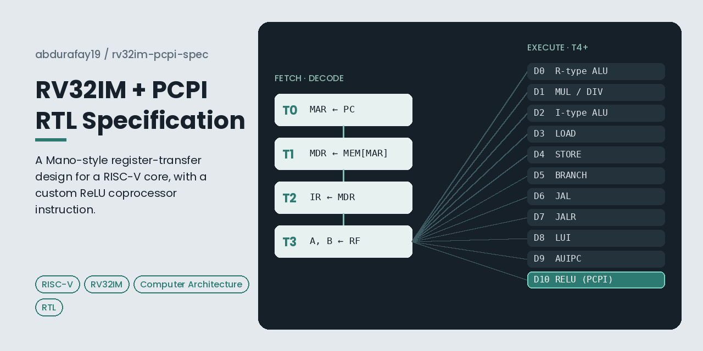
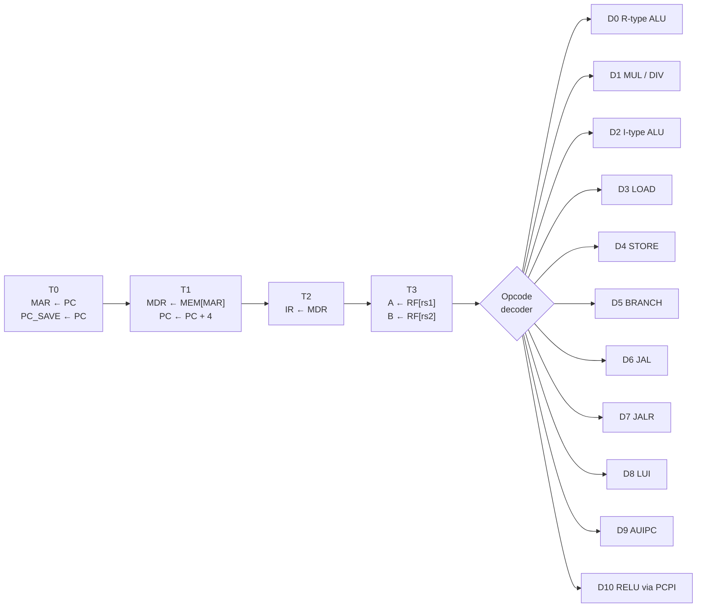

# RV32IM + PCPI: A Mano-Style RTL Specification

A register-transfer level (RTL) specification for a multi-cycle RISC-V processor that implements the **RV32I base integer ISA**, the **RV32M multiply/divide extension**, and a **custom coprocessor instruction (RELU)** connected through a PCPI-style handshake.

Every instruction is described as a sequence of timing states (T0, T1, T2, ...) in the classical style of M. Morris Mano's *Computer System Architecture*, so the design reads like the Mano Basic Computer, scaled up to a real, modern ISA.

📄 **[Read the full specification (PDF)](./RV32IM_PCPI_RTL.pdf)**

  

---

## Why this project

I built the [Mano Basic Computer in Logisim](https://github.com/abdurafay19/mano-machine-logisim) gate by gate. This specification takes the same register-transfer method and applies it to RISC-V, the open ISA used in real processors today.

The custom **RELU** instruction connects the design to machine learning. ReLU (`max(0, x)`) is the most common activation function in neural networks, and the PCPI coprocessor interface shows how a core can hand ML operations to dedicated hardware, which is the same idea behind modern AI accelerators.

## What the specification covers

| Area | Details |
|---|---|
| **Base ISA** | RV32I integer instructions: R-type and I-type ALU ops, loads, stores, branches, JAL, JALR, LUI, AUIPC |
| **M-extension** | MUL, MULH, MULHSU, MULHU, DIV, DIVU, REM, REMU, including RISC-V's defined divide-by-zero and overflow results |
| **Custom instruction** | RELU on the `custom-0` opcode (0x0B), executed by an external coprocessor |
| **Coprocessor interface** | PCPI handshake (valid, wait, ready) following the convention from PicoRV32 |
| **Control** | A 4-bit sequence counter (T0–T15) and an opcode-driven decoder that selects one of 11 execution classes (D0–D10) |

## How an instruction executes

Every class ends with `COUNTER ← T0`, which returns control to Fetch.

## Cycles per instruction

Fetch and decode take 4 cycles (T0–T3) for every instruction. Execution then takes:

| Class | Instructions | Total cycles |
|---|---|---|
| D8 | LUI | 6 |
| D0, D1, D2 | R-type ALU, M-extension, I-type ALU | 7 |
| D5, D6, D7, D9 | Branches, JAL, JALR, AUIPC | 7 |
| D4 | Stores | 8 |
| D10 | RELU (PCPI) | 8, plus any coprocessor stall cycles |
| D3 | Loads | 9 |

## Key design decisions

**Opcode-only top-level decode.** The sequencer branches purely on the opcode field. R-type ALU (D0) and the M-extension (D1) share opcode 0x33, so `funct7[0]` separates them before the ALU and multiplier paths split.

**Architecturally defined division edge cases.** Unlike C, RISC-V defines the results of dividing by zero and of `INT_MIN / -1`, so the divider datapath handles these cases explicitly.

**A real handshake, even for a one-cycle operation.** ReLU is purely combinational, but the specification still uses the full PCPI wait/ready handshake. That keeps the interface general, so a multi-cycle coprocessor (such as a multiply-accumulate unit) can stall the core without any change to the control logic.

**Room to grow.** RISC-V reserves four custom opcode blocks (custom-0 to custom-3) that will never collide with standard extensions. RELU uses custom-0, leaving three free for future coprocessor instructions.

## Roadmap

- [x] RTL specification for RV32I, RV32M and a PCPI RELU instruction
- [ ] FENCE, ECALL and EBREAK (SYSTEM and MISC-MEM opcodes)
- [ ] Timeout trap for PCPI instructions that no coprocessor claims
- [ ] SystemVerilog implementation, verified against the official RISC-V test suite
- [ ] Multi-cycle multiply-accumulate (MAC) coprocessor for running a small neural network

## Files

| File | Description |
|---|---|
| [`RV32IM_PCPI_RTL.pdf`](./RV32IM_PCPI_RTL.pdf) | The full register-transfer specification |
| [`docs/social-preview.png`](./docs/social-preview.png) | Overview diagram of the control flow |

## References

1. RISC-V International. *The RISC-V Instruction Set Manual, Volume I: Unprivileged ISA.* <https://riscv.org/technical/specifications/>
2. Clifford Wolf. *PicoRV32: A Size-Optimized RISC-V CPU.* <https://github.com/YosysHQ/picorv32> (see the Pico Co-Processor Interface section)
3. M. Morris Mano. *Computer System Architecture*, Chapter 5: Basic Computer Organization and Design.

## Author

**Abdul Rafay**, CS student at Information Technology University (ITU), Lahore, and Teaching Assistant for Computer Architecture.

[LinkedIn](https://www.linkedin.com/in/abdurafay19/) · [GitHub](https://github.com/abdurafay19)
